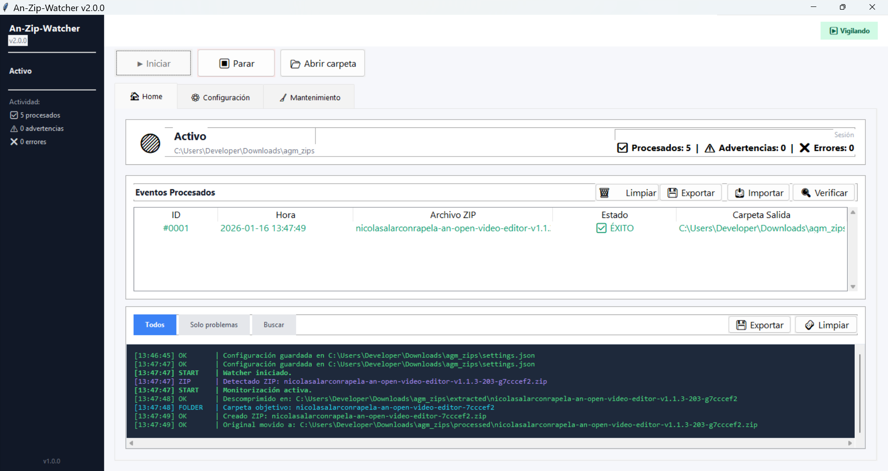

#  An-Zip-Watcher




_Construido por AnAppWiLos y ViveCoding :)_
## **v2.1.6**

**An-Zip-Watcher** es una herramienta de monitoreo y automatización para el procesamiento de archivos ZIP. Detecta automáticamente nuevos archivos en una carpeta vigilada, los descomprime, procesa su contenido y genera un nuevo paquete ZIP estandarizado en una carpeta de salida, manteniendo un registro detallado de todas las operaciones.

---

## 🚀 Características Principales

### 👁️ Monitoreo Inteligente

- **Detección Automática**: Vigila constantemente una carpeta asignada en busca de nuevos archivos `.zip`.
- **Estabilidad de Archivos**: Espera inteligentemente a que los archivos terminen de copiarse antes de procesarlos.
- **Validación**: Verifica la integridad de los ZIPs antes de intentar abrirlos.

### 🔄 Procesamiento Automatizado

1. **Cola de procesamiento**: Los ZIPs detectados se encolan para procesarse de forma ordenada.
2. **Descompresión**: Extrae el contenido en una subcarpeta temporal.
3. **Re-empaquetado**: Identifica la carpeta raíz del contenido y crea un nuevo ZIP limpio.
4. **Organización**: Mueve el archivo original a `processed` y el nuevo ZIP a `output`.

### 🖥️ Interfaz Moderna (Tabbed UI)

- **🏠 Home**:
  - **Dashboard**: Estado del servicio y contadores de actividad en tiempo real.
  - **Eventos Procesados**: Tabla detallada con historial de operaciones, estado (✅/⚠️/❌) y acceso rápido a carpetas.
  - **Logs**: Consola de registro con filtrado avanzado y búsqueda.
- **⚙️ Configuración**: Ajuste de rutas, tiempos de espera y reintentos.
- **🧹 Mantenimiento**: Herramientas para limpiar carpetas de trabajo y gestionar la papelera interna.

### 💾 Persistencia de Sesiones

- **Auto-guardado**: La sesión se guarda automáticamente al cerrar la aplicación.
- **Historial Completo**: Exporta e importa sesiones para auditoría o backups.
- **Verificación de Integridad**: Herramienta para auditar si los archivos procesados siguen existiendo o han sido eliminados.

---

## 🛠️ Instalación y Uso

### Requisitos

- Windows (Probado en Windows 10/11)
- Python 3.10+ (Si se ejecuta desde el código fuente)

### Ejecución

1. Ejecuta la aplicación:
   ```bash
   py an_zip_watcher.py
   ```
2. **Primera Vez**: La app te pedirá seleccionar una "Carpeta de Vigilancia".
3. **Configurar**: Ajusta los parámetros si es necesario y guarda.
4. **Iniciar**: Pulsa el botón `▶ Iniciar` para comenzar el monitoreo.

---

## 📂 Estructura de Carpetas

La aplicación creará automáticamente las siguientes subcarpetas dentro de tu directorio de vigilancia:

- `processed/`: Archivos originales movidos tras el procesamiento.
- `extracted/`: Carpeta temporal de descompresión (se puede limpiar desde Mantenimiento).
- `output/`: Destino de los nuevos archivos ZIP generados.
- `Trash/`: Papelera interna de seguridad para archivos eliminados desde la app.

---

## 🧩 Desarrollo

### Stack Tecnológico

- **Lenguaje**: Python 3
- **GUI**: Tkinter + ttk (Tema moderno 'Azure'/'Sun-Valley' style inspiration)
- **Arquitectura**: Threading para monitoreo no bloqueante.

### Comandos Útiles

- **Construir ejecutable**: `py build.py`
- **Gestionar versión**: `py version_manager.py`

---

**Autor**: AnAppWiLos
**Licencia**: MIT
**Versión**: 2.1.6
